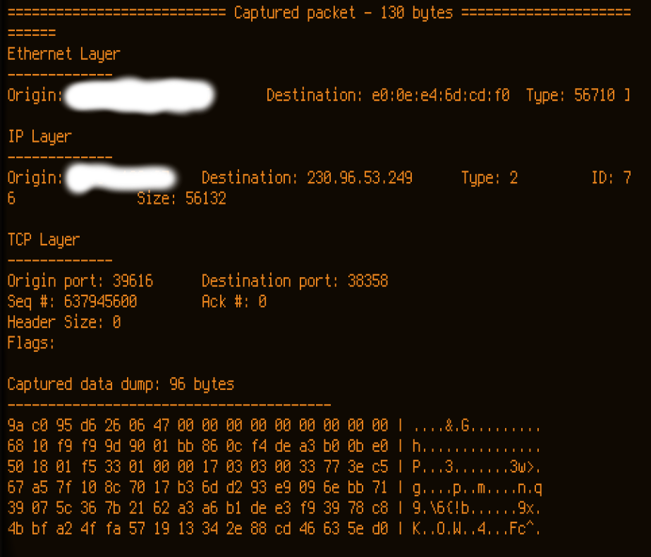

# packet-sniffer
A simple packet sniffer written in C

Dependency: libpcap

Instructions: in order to run the sniffer, compile the source code using "gcc -o sniffer sniffer.c utils.c -lpcap" or any other compiler. The program makes use of raw sockets and therefore requires elevated privilleges to run. 

Below is a demo run

